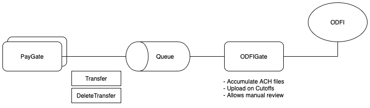

## ODFI management

ODFIGate is responsible for uploading ACH files to an ODFI. This includes grouping them together to minimize the number of files sent and offering review capability prior to upload. Also, returns are handled and updates made by interacting with PayGate's endpoints.

ACH files are read from a message queue and grouped prior to sendoff. There are also rules applied to each file which limit its ability to be merged for upload.

<div style="text-align: center;"></div>

Incoming files are handled by ODFIGate and are one of the following: Correction (COR/NOC), returns, and prenotes.

#### Outgoing files

```go
type OutgoingFile struct {
    transfer *paygate.Transfer // From/To Customer and bank acccount, amount, etc..
    file *ach.File // JSON format?
}
```

Note: We need to store the Transfer ID, To/From Customers, Bank Accounts / Depositories. Hashed account number and routing number lookups should be done against PayGate's HTTP server.

Transfer deletion in PayGate throws an event to ODFIGate which prevents that file from upload. Once a delete message comes through (which only needs a TransferID) that transfer will never be included.

#### Corrections

The respective `Depository` or `Transfer` is updated from the file. Initial lookups and updates are performed over HTTP to the service.

- C01, C03, C06, C07 update Depository account number
- C02, C03, C07 update Depository routing number
- C04 updates individual name TODO(adam)
- C09 updates originator identification TODO(adam)
- C05, C06, C07, C08 reject Depository
- C13, C14 are file format errors

#### Returns

**Transfers**

Returned transfers are handled by ODFIGate and based on the return code another object is updated. (e.g. R02, R03, ...) Temporary returns (e.g. R01) just need to mark a transfer as failed and others signal a formatting error (R25, R26, R27, etc). These objects are updated with PayGate's HTTP endpoints.

We should also save the return information in PayGate so it can serve that to users. Accounting transactions should be reversed.

**Micro-Deposits**

A micro-deposit is a low dollar transfer made to verify account access. These being returned should be handled like regular Transfers. Accounting transactions should be reversed.

#### Prenotes

Prenote entries should be handled by doing lookups with PayGate to see if that bank account / depository exists and is verified.
