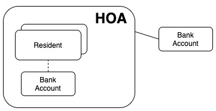
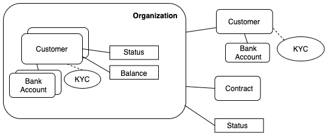
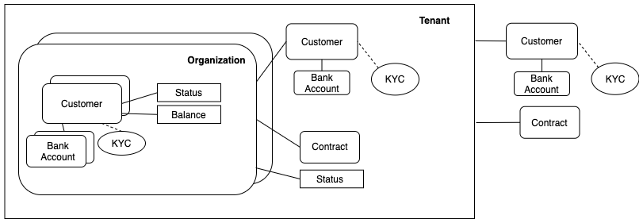

## Homeowner Association as a Service

Imagine a home owner association (HOA) wants to accept dues over ACH from their residents. You could imagine they would view the problem as having a bunch of residents each responsible for dues coming out of their bank account. Those are collected into the HOA's bank account for later withdraw. This model would look like the following:

Behind the scenes the HOA would have to comply with various laws such as a sanction search (KYC) for each resident and the HOA would have to pass a KYC check on themselves. These are required by the US Government and might not even be known are checked by the HOA.

PayGate mirrors this worldview by treating an HOA or any entity moving money over ACH as an `Organization` with `Customer` objects linked under it. Each `Customer` goes through regular KYC checks as well as the HOA. As computations off each `Customer` is their current balance and status (e.g. "verified" so we can pull money from them).

The HOA/Organization also has its primary customer referenced along with any contract documents that were signed on the initial setup. Also, the current status of the Organization would be available if as they will need approval prior to any transfers being made, or if they are put into a frozen status.

PayGate should be built as a multi-tenant application which can support any number of Organizations and as such will be setup to manage each `Tenant` and its various Organizations. This allows us to serve multiple clients from a cluster of PayGate instances for better availability and performance to our clients.

This setup allows a "HOA-as-a-service" vendor to leverage PayGate and resell ACH services to multiple HOA's. The vendor signs up as a `Tenant` and has access to Organizations of their clients.

Since we are doing business with the vendor we'll need to perform a KYC check, have a bank account for us to collect fees/payment with, and any signed contracts defining the service terms.

PayGate runs and manages any number of Tenants with their linked Organizations through RESTful endpoints. This allows us to cluster PayGate ontop of a database like MySQL and send off transfers to be uploaded to our ODFI.
